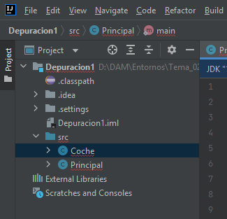
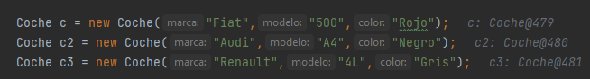
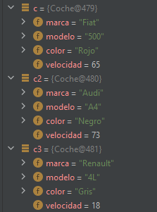
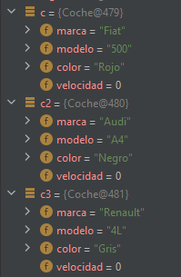
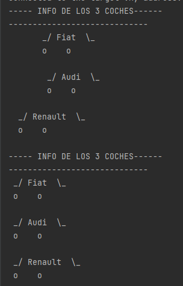

# TASCA 2. 

**Objectiu:**
Saber obtindre les dades d'un codi java mitjançant eina de depuració de codi.

**Enunciat:**
Donat el codi a JAVA de la classe cotxe que compta amb els mètodes:

- constructor on se li estableix la marca, model, color i la velocitat inicial del qual és 0.
- getters i setters de cada paràmetre. 
- Mètode accelera (int vel) que incrementa la velocitat del cotxe en “vel” Km/h.
- Mètode frena(int vel) que decrementa la velocitat del cotxe en “vel” Km/h.
- para() que posa la velocitat a 0.
- pinta() que pinta el cotxe més a prop o més lluny segons la velocitat que tinga en aqueix
moment.

A més, la classe Principal té el mètode:

`public static void main(String [] args)` -> punt d'inici del programa

### 0. Importar el projecte en INTELLIJ.



### 1. Explicad QUÈ FA EL MÈTODE MAIN.

El método `main` funciona como *entrypoint* para la clase, aquí se instancian tres objetos de la clase **Coche** y agrupa las llamadas a métodos de cada objeto.  

Primero instancia los tres coches de la clase Coche y les da varios atributos (marca, modelo y color) que se pasan al constructor.  
Después se instancia **Random** de la librería **util** de Java para conseguir un número aleatorio que servirá para asignar la velocidad inicial de cada coche. Dicha velocidad se asigna en la llamada al método `acelera()` pasándose como parámetro.  
Se pinta por pantalla la información de los tres coches.  
Posteriormente se vuelve a generar otros tres números aleatorios para nuevamente cambiar la velocidad de cada uno de los tres coches, pasando por parámetro al método `frena()` dichos valores.  
Por último, se pinta de nuevo la información de los tres coches.

### 2. Posad un punt de ruptura (breakpoint) en la línia 27 del mètode main de la classe Principal i esbrineu els valors de les variables velocitat_nueva1, velocitat_nueva2 i velocitat_nueva3. Esbrineu també quines dades tenen en els seus paràmetres els cotxes amb variables c, c2 i c3.

El valor de las tres variables es aleatorio, aunque es en un rango de 0 a 80 porque el `bound` está a 80, que es el límite hasta donde puede llegar el aleatorio. Si se quisiera empezar en otro rango en lugar de 0 se usaría el parámetro `origin`.  
En este caso sus valores son:

```java
velocidad_nueva1 = 73
velocidad_nueva2 = 18
velocidad_nueva3 = 65
```

En otra ejecución los valores son: 4, 76 y 68.

En el caso de los parámetros de los coches se puede ver en estas líneas:

Código:



Depuración:



Nota: las velocidades (al acelerar) se están asignando al coche2, coche3 y coche1, por eso se ve diferente.

### 3. Posad un punt de ruptura (breakpoint) en la línia 46 del mètode main de la classe Principal i esbrineu els valors de les variables velocitat_nueva1, velocitat_nueva2 i velocitat_nueva3. Esbrineu també quines dades tenen en els seus paràmetres els cotxes amb variables c, c2 i c3.

Antes de obtener los nuevos aleatorios y de frenar, todos los coches aceleran. Dicha aceleración es en base al número que se obtiene del primer aleatorio (si `velocidad_nueva1 = 14`, la velocidad de aceleración del primer coche es de 14).

Después se vuelve a obtener un número aleatorio de velocidad para cada coche, pero en este caso el límite está entre 0 y 100. Estos valores se reasignan a las variables de velocidad, pero no a cada coche en sí.

```java
velocidad_nueva1 = 96
velocidad_nueva2 = 99
velocidad_nueva3 = 57
```

Luego cada coche frena, y ahí sí cambia la velocidad de cada coche haciendo una diferencia entre la velocidad del coche (que se asignó al acelerar) y la frenada del coche. Si el coche tenía una velocidad de 50 por ejemplo y frena 25, ahora la velocidad del coche es de 25.  
Entrando al método `frenar()` se puede ver que si el resultado de la diferencia es menor de 0 (un número negativo), se aplica 0 a la velocidad del coche.



En este caso la diferencia de los valores hace frenar a todos los coches de golpe.

Foto de la aceleración y de la frenada de cada coche:



**Nota:** Realitzeu les captures de pantalla que cregueu convenient per a adjuntar en el document (per exemple com pinta els cotxes el programa abans de frenar i després de frenar).

Contesteu les qüestions en un fitxer markdown i pugeu-lo al vostre repositori GITHUB. Dins d'una carpeta anomenada Depuración2 Compartiu la URL del repositori.

**Nota:** El mètode nextInt(valor) de la clase Random obtí un número aleatori entre 0 i val.